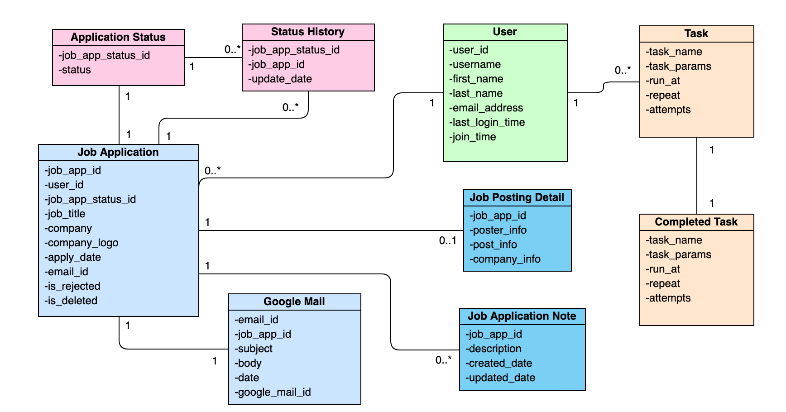
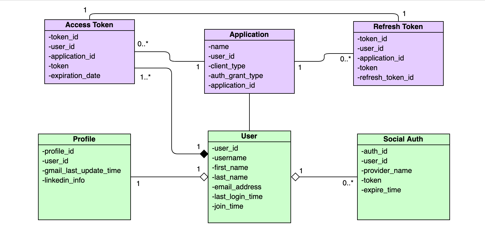

# UML Class Diagram

UML Class diagram is a type of static structure diagram that describes the structure of a system by showing the system's classes, their attributes, operations (or methods), and the relationships among objects.

## Authentication Flow 

## General Flow 

